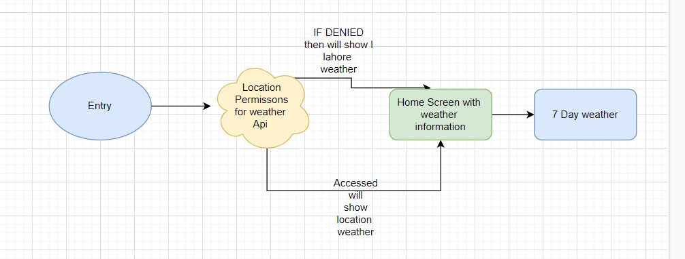

# Weatherity (the best weather app 😅)

A weather app built using the flutter framework and open weather api
## User Flow Diagram and Description

## Use Cases and description

 
### Description:  ####
A Flutter app made using openweathear api which shows the current weather of your location.

### Use Cases:

#### Show default weather
When no permission access has been granted, the app should show the default weather of lahore city
#### Ask for location persmission
The app should ask for location permissions on first time installation, and everytime it's started it should ensure that location services are enabled.
#### Display weather information
App should display daily, hourly and 7 day forcast with all weather information of the current location.
#### Dynamic Background
The Apps should change its background with each type of weather.

#### Search Specific weather
App should allow the user to see the weather of a valid searched location

## Video defining the use cases one by one

